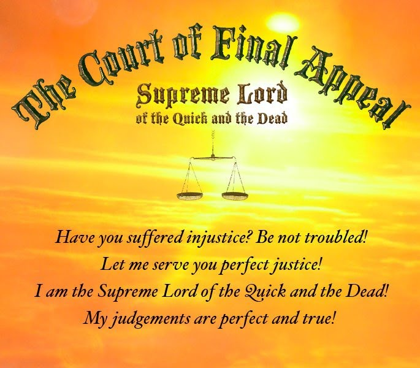

<body style="color: #FFFFFF; background-color: #000000;">
  

 

<h3>State your case in the form above. Be precise and concise. If someone has wronged you, state that person's name clearly. I will consider each and every case and mete out judgement accordingly! Some judgements are quick, others take time. I know best. This I promise: Perfect justice will be served to all — the living and the dead!!</h3>

<h6>!!!!!!!!!!!!!!!!!!!!!!!!!!!!!!!!!!!!!!!!!!!!!!!!!!!!!!!!!!!!!!!!!!!!!!!!!!!</h6>

<h4>You will have to account for your words and deeds.  
If my investigations show that your appeal is groundless,  
be prepared for double the trouble!!</h4>

 

<h6>© 2008 Supreme Lord of The Court of Final Appeal</h6>

<h6><em>For entertainment only.</em></h6>

  

    </body>
